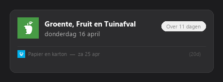

# Mijn Afvalwijzer - Home Assistant Integratie

Custom Home Assistant integratie die je eerstvolgende afvalophaaldata toont. Ondersteunt meerdere afvalinzamelaars in Nederland.



> **Belangrijk!** Controleer eerst of jouw adres werkt op de website van je afvalinzamelaar. Ga naar de website, vul je postcode en huisnummer in en kijk of er ophaaldata verschijnen. Als jouw adres daar niet werkt, zal deze integratie ook geen data kunnen ophalen.

## Ondersteunde afvalinzamelaars

| Inzamelaar | Website |
|---|---|
| Mijn Afvalwijzer | mijnafvalwijzer.nl |
| Afvalstoffendienstkalender | afvalstoffendienstkalender.nl |
| HVC Groep | hvcgroep.nl |
| GAD | gad.nl |
| DAR | dar.nl |
| Cure | cure-afvalbeheer.nl |
| Cyclus | cyclusnv.nl |
| RMN | rmn.nl |
| Reinis | reinis.nl |
| Saver | savermbt.nl |
| PreZero | prezero.nl |
| Area Reiniging | areareiniging.nl |
| ROVA | rova.nl |
| RD4 | rd4.nl |
| Avalex | avalex.nl |
| Twente Milieu | twentemilieu.nl |
| Circulus | circulus.nl |
| Meerlanden | meerlanden.nl |
| Waardlanden | waardlanden.nl |

## Kenmerken

- Enkele sensor die de **eerstvolgende ophaling** toont, ongeacht afvaltype
- Tweede ophaling wordt kleiner eronder getoond
- Custom Lovelace-kaart met afvaliconen
- Kaart wordt automatisch geladen — geen handmatige resource-configuratie nodig
- Automatische update om middernacht zodat "dagen tot" altijd klopt
- Haalt automatisch nieuwe data op wanneer alle ophaaldatums verstreken zijn
- Ondersteunt GFT, PMD, Restafval en Papier en karton

## Installatie

### HACS (aanbevolen)

1. Open HACS in Home Assistant
2. Klik op de drie puntjes (rechtsboven) en kies **Custom repositories**
3. Voeg de URL van deze repository toe en selecteer **Integration** als categorie
4. Klik op **Install**
5. Herstart Home Assistant

### Handmatig

1. Kopieer de map `custom_components/mijnafvalwijzer` naar je Home Assistant `config/custom_components/` map
2. Herstart Home Assistant

## Instellen

1. Ga naar **Instellingen > Apparaten & Services**
2. Klik op **+ Integratie toevoegen**
3. Zoek op **Mijn Afvalwijzer**
4. Selecteer je **afvalinzamelaar** uit de lijst
5. Vul je **postcode** (bijv. `1234AB`) en **huisnummer** in

## Dashboard-kaart

Na installatie kun je de kaart toevoegen aan je dashboard:

1. Bewerk je dashboard
2. Klik op **+ Kaart toevoegen**
3. Zoek op **Mijn Afvalwijzer**
4. Stel de entity in op `sensor.volgende_ophaling`

Of voeg handmatig toe via YAML:

```yaml
type: custom:mijnafvalwijzer-card
entity: sensor.volgende_ophaling
```

## Sensor-attributen

| Attribuut | Omschrijving |
|---|---|
| `type` | Korte naam (bijv. PMD, GFT) |
| `type_full` | Volledige naam (bijv. Plastic, Metalen en Drankkartons) |
| `days_until` | Dagen tot volgende ophaling |
| `day_of_week` | Dag van de week |
| `next_type` | Korte naam van de ophaling daarna |
| `next_type_full` | Volledige naam van de ophaling daarna |
| `next_date` | Datum van de ophaling daarna |
| `next_days_until` | Dagen tot de ophaling daarna |

---

# Mijn Afvalwijzer - Home Assistant Integration (English)

Custom Home Assistant integration that shows your upcoming waste collection dates. Supports multiple waste collectors in the Netherlands.

> **Important!** Before installing, verify that your address works on your waste collector's website. Go to the website, enter your postcode and house number, and check if collection dates appear. If your address is not supported there, this integration will not be able to fetch any data.

## Supported waste collectors

Mijn Afvalwijzer, Afvalstoffendienstkalender, HVC Groep, GAD, DAR, Cure, Cyclus, RMN, Reinis, Saver, PreZero, Area Reiniging, ROVA, RD4, Avalex, Twente Milieu, Circulus, Meerlanden, and Waardlanden.

## Features

- Single sensor showing the **next upcoming pickup** across all waste types
- Second pickup shown below in smaller text
- Custom Lovelace card with waste type icons
- Card auto-registers — no manual resource setup needed
- Automatic midnight update so "days until" is always accurate
- Auto-refreshes when all dates have passed to fetch the new year's schedule
- Supports GFT, PMD, Restafval, and Papier en karton

## Installation

### HACS (recommended)

1. Open HACS in Home Assistant
2. Click the three dots (top right) and select **Custom repositories**
3. Add this repository URL and select **Integration** as the category
4. Click **Install**
5. Restart Home Assistant

### Manual

1. Copy the `custom_components/mijnafvalwijzer` folder to your Home Assistant `config/custom_components/` directory
2. Restart Home Assistant

## Setup

1. Go to **Settings > Devices & Services**
2. Click **+ Add Integration**
3. Search for **Mijn Afvalwijzer**
4. Select your **waste collector** from the dropdown
5. Enter your **postcode** (e.g. `1234AB`) and **house number**

## Dashboard Card

After installation, add the card to your dashboard:

1. Edit your dashboard
2. Click **+ Add Card**
3. Search for **Mijn Afvalwijzer**
4. Set the entity to your `sensor.volgende_ophaling`

Or add it manually in YAML:

```yaml
type: custom:mijnafvalwijzer-card
entity: sensor.volgende_ophaling
```

## Sensor Attributes

| Attribute | Description |
|---|---|
| `type` | Short name (e.g. PMD, GFT) |
| `type_full` | Full name (e.g. Plastic, Metalen en Drankkartons) |
| `days_until` | Days until next pickup |
| `day_of_week` | Day of the week |
| `next_type` | Short name of the pickup after |
| `next_type_full` | Full name of the pickup after |
| `next_date` | Date of the pickup after |
| `next_days_until` | Days until the pickup after |
